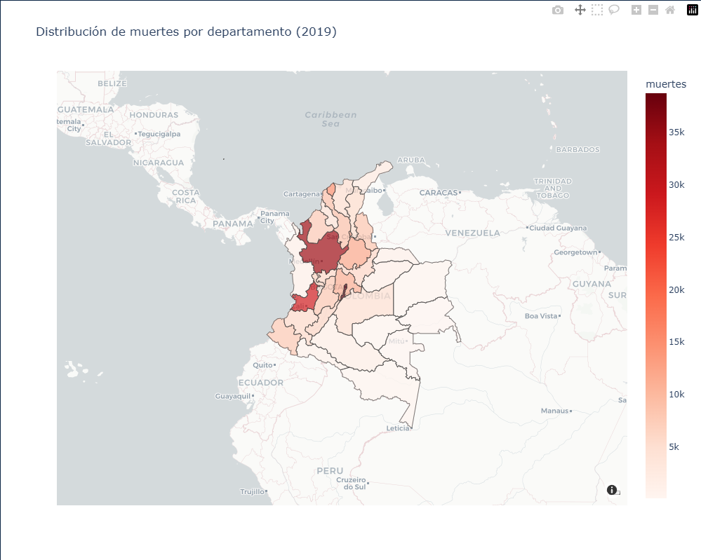

## Introducción

La actividad se desarrolla con la intención de demostrar de manera practica los conocimientos 
adquiridos durante el curso de aplicaciones 1 el cual nos permite mediante una fuente de datos,
 graficar, tratar y filtrar los datos según los requerimientos

## objetivo
Esta actividad, tiene como finalidad analizar la mortalidad en Colombia para el año 2019,
 desarrollar una aplicación web mediante el uso de Plotly y Dash en Python.
 integrando informes gráficos interactivos que faciliten la interpretación de los datos y permitan una exploración visual.
 
## Estructura
 -Data
	-Anexo1.NoFetal2019_CE_15-03-23.xlsx
	-Anexo2.CodigosDeMuerte_CE_15-03-23.xlsx
	-Divipola_CE_.xlsx
-src/
-app.py -> Aplicación Dash (visualizaciones)
-dataprocessing.py -> Funciones que procesan los .xlsx y devuelven DataFrame 
 
-requirements.txt -> Dependencias
-README.md

## Requisitos
### Librerias
 dash
pandas
plotly
openpyxl
numpy
### versiones
python-3.12.0

## Despliegue
Este documento describe paso a paso el proceso realizado para desplegar una aplicación desarrollada en Python con Dash en la plataforma Render. Se incluyen las configuraciones locales, los archivos necesarios y las configuraciones efectuadas en el panel de Render.
1. Preparación del proyecto local
Se creó una carpeta llamada 'ejemplo' que contiene los archivos principales del proyecto. Dentro de esta carpeta se crearon los siguientes archivos:
• app.py – Archivo principal con la aplicación Dash.
• requirements.txt – Archivo que contiene las dependencias necesarias para la aplicación.
• Procfile – Archivo que indica a Render cómo ejecutar la aplicación.
• runtime.txt – Archivo opcional para definir la versión de Python utilizada.
2. Código de configuración del puerto en el archivo app.py
if __name__ == "__main__":
    port = int(os.environ.get("PORT", 8050))
    app.run(host="0.0.0.0", port=port)

3. Archivo requirements.txt
Se agregaron las siguientes dependencias mínimas:
dash
plotly
pandas
4. Archivo Procfile
El archivo Procfile contiene la siguiente línea para indicar el comando de inicio:
web: python app.py
5. Archivo runtime.txt
Este archivo especifica la versión de Python utilizada:
python-3.12.6
6. Configuración en GitHub
1. Se creó un repositorio llamado 'pruebadespliegue' en GitHub.
2. Se inicializó Git en la carpeta local con los comandos:
   git init
   git add .
   git commit -m 'Primer despliegue'
   git branch -M main
3. Se agregó el remoto del repositorio con:
   git remote add origin https://github.com/BaasRoss/Actividad-4.git
4. Se subió el proyecto con:
   git push -u origin main
7. Configuración en Render
En la plataforma Render (https://render.com), se siguieron los siguientes pasos:
1. Se inició sesión con la cuenta de GitHub.
2. Se seleccionó la opción 'New +' y luego 'Web Service'.
3. Se eligió el repositorio 'pruebadespliegue'.
4. En la configuración se seleccionó:
   - Environment: Python
   - Build Command: pip install -r requirements.txt
   - Start Command: python app.py
5. Se presionó 'Create Web Service' para iniciar el despliegue.
8. Resultado del despliegue
Una vez finalizado el proceso, Render generó una URL pública con el mensaje de confirmación: 'Your service is live at https://actividad-4-241x.onrender.com/'. Al ingresar a dicha URL, se puede visualizar la aplicación Dash funcionando en línea.
## Software
Python
Dash
Render

## Instalación
1. Clonar repo:
```bash
git clone <https://github.com/BaasRoss/Actividad-4.git>
cd Proyecto2
```

2. Instalar dependencias:
```bash
python3 -m pip install -r requirements.txt
```
 
3. Ejecutar la aplicación:
```bash
python src/app.py
```
Abrir: http://127.0.0.1:8050
## Visualizaciones con explicaciones de los resultados

 